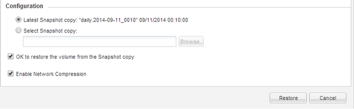

= 从 SnapVault 备份还原数据
:icons: font
:imagesdir: ../media/

[role="lead"]
选择 SnapVault 备份目标卷后，您必须对新卷执行还原操作以测试备份的数据，或者对现有卷执行还原操作以还原丢失或损坏的数据。

您必须从 * 目标 * 集群执行此任务。

.步骤
. 根据您运行的 System Manager 版本，执行以下步骤之一：
+
** ONTAP 9.4 或更早版本：单击 * 保护 * > * 关系 * 。
** 从 ONTAP 9.5 开始：单击 * 保护 * > * 卷关系 * 。

. 选择包含 SnapVault 备份目标卷的 SVM ，然后单击 * 操作 * > * 还原 * 。
. 在 * 还原 * 对话框中，将数据还原到原始源卷或新卷：
+
|===
| 要还原到的对象 | 那么 ... 

 a| 
原始源卷
 a| 
选择 * 源卷 * 。

 a| 
新卷
 a| 
.. 选择 * 其他卷 * 。
.. 为卷选择对等集群和对等 SVM 。
.. 从列表中选择对等 SVM 。
.. 如果 SVM 未建立对等关系，请创建 SVM 对等关系：
+
... 选择 SVM 。
... 单击 * 身份验证 * 。
... 输入对等集群的集群管理员凭据，然后单击 * 创建 * 。

.. 选择 * 新建卷 * 。
.. 如果要更改以 `destination SVM_name_destination_volume_name_restore` 格式显示的默认名称，请指定一个新名称并选择卷所在的聚合。
.. 选中 * 启用重复数据删除 * 复选框。

|===
+
image:../media/restore_to.gif["选择要还原的卷"]

. 选择最新的 Snapshot 副本或选择要还原的特定 Snapshot 副本。
. 选中 * 确定从 Snapshot 副本还原卷 * 复选框。
. 选中 * 启用网络压缩 * 复选框以压缩在还原操作期间传输的数据。
. 单击 * 还原 * 。
+
在还原过程中，要还原的卷将更改为只读。还原操作完成后，系统将删除临时关系，并将还原的卷更改为读 / 写卷。

+

. 单击消息框中的 * 确定 * 。

